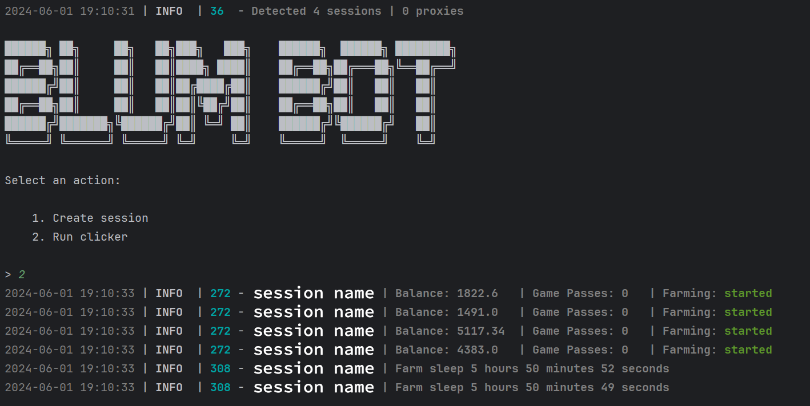

## Функционал

| Функционал                           | Поддерживается |
|--------------------------------------|:--------------:|
| Многопоточность                      |       ✅        |
| Привязка прокси к сессии             |       ✅        |
| Авто-игра                            |       ✅        |
| Автофарм                             |       ✅        |
| Автовыполнение заданий               |       ✅        |
| Создание аккаунта Blum если его нету |       ✅        |

## [Настройки](./.env-example)

| Настройка               | Описание                                                                  |
|-------------------------|---------------------------------------------------------------------------|
| **API_ID / API_HASH**   | Данные платформы, с которой запускать сессию Telegram _(сток - Android)_  |
| **REFERRAL_CODES**      | Реферальный код для создания аккаунта Blumm если его нету                 |
| **USE_PROXY_FROM_FILE** | Использовать-ли прокси из файла `bot/config/proxies.txt` _(True / False)_ |

## Быстрый старт 📚

1. Чтобы установить библиотеки в Windows, запустите INSTALL.bat.
2. Для запуска бота используйте `START.bat` (или в консоли: `python main.py`).

## Предварительные условия

Прежде чем начать, убедитесь, что у вас установлено следующее:

- [Python](https://www.python.org/downloads/) версии 3.11.

## Получение API ключей

1. Перейдите на сайт [my.telegram.org](https://my.telegram.org) и войдите в систему, используя свой номер телефона.
2. Выберите **"API development tools"** и заполните форму для регистрации нового приложения.
3. Запишите `API_ID` и `API_HASH` в файле `.env`, предоставленные после регистрации вашего приложения.

## Установка

Вы можете скачать [**Репозиторий**](https://github.com/fafatypoty/BlumBot) клонированием на вашу систему и
установкой необходимых зависимостей:

```shell
~ >>> git clone https://github.com/fafatypoty/BlumBot.git
~ >>> cd BlumBot

# Linux
~/BlumBot >>> python3 -m venv venv
~/BlumBot >>> source venv/bin/activate
~/BlumBot >>> pip3 install -r requirements.txt
~/BlumBot >>> cp .env-example .env
~/BlumBot >>> nano .env  # Здесь вы обязательно должны указать ваши API_ID и API_HASH , остальное берется по умолчанию
~/BlumBot >>> python3 main.py

# Windows
~/BlumBot >>> python -m venv venv
~/BlumBot >>> venv\Scripts\activate
~/BlumBot >>> pip install -r requirements.txt
~/BlumBot >>> copy .env-example .env
~/BlumBot >>> # Указываете ваши API_ID и API_HASH, остальное берется по умолчанию
~/BlumBot >>> python main.py
```

Также для быстрого запуска вы можете использовать аргументы, например:

```shell
~/BlumBot >>> python3 main.py --action (1/2)
# Или
~/BlumBot >>> python3 main.py -a (1/2)

# 1 - Создает сессию
# 2 - Запускает кликер
```